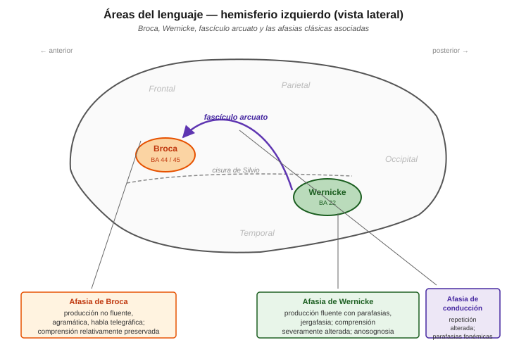
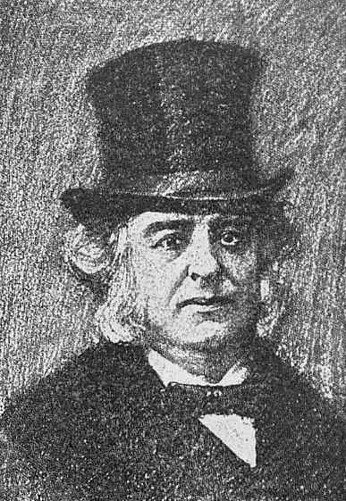
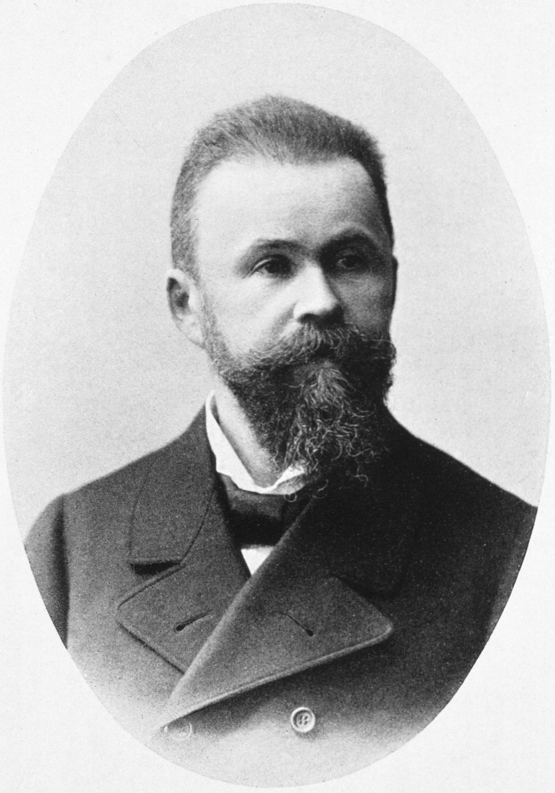

# Áreas de Broca y Wernicke y sus afasias clásicas

Las dos regiones perisilvianas del hemisferio izquierdo que fundaron la aphasiology moderna: **el área de Broca** en el lóbulo frontal inferior y **el área de Wernicke** en el lóbulo temporal superior posterior. Unidas por el **fascículo arcuato**, forman el circuito clásico del procesamiento del lenguaje. Cada una tiene un síndrome afásico asociado con un perfil distintivo, y la desconexión entre ellas produce un tercer síndrome (la afasia de conducción). Esta entrada cubre la anatomía, la clínica y las revisiones contemporáneas.

Complementa la entrada sobre el [triángulo / casita de Wernicke-Lichtheim](triangulo-lichtheim-wernicke.md), que sistematiza teóricamente los siete síndromes predichos por el modelo clásico.

## Diagrama anatómico

<figure markdown="span">
  { width="720" }
  <figcaption><strong>Vista lateral del hemisferio izquierdo</strong>. Las dos áreas clásicas del lenguaje (Broca en naranja, Wernicke en verde) están separadas por la <strong>cisura de Silvio</strong> (línea punteada) y unidas por el <strong>fascículo arcuato</strong> (línea violeta), un haz de fibras de sustancia blanca que arquea por encima de la cisura. Cada área tiene un síndrome afásico asociado; la desconexión de la vía arcuato produce un tercer síndrome.</figcaption>
</figure>

## Área de Broca

### Ubicación anatómica

- **Lóbulo frontal inferior izquierdo**, específicamente la tercera circunvolución frontal.
- **Áreas de Brodmann 44 y 45** (BA 44 = *pars opercularis*, BA 45 = *pars triangularis*).
- Anterior al surco central, superior a la cisura de Silvio.
- Aproximadamente adyacente y anterior al área motora primaria de la cara (que sí controla los músculos articulatorios).

### Descubrimiento histórico

<figure markdown="span">
  { width="220" }
  <figcaption><strong>Paul Broca (1824-1880)</strong>, cirujano y antropólogo francés. Publicó en 1861 el caso Leborgne (Tan), fundando la aphasiology moderna y la doctrina de localización cerebral del lenguaje.</figcaption>
</figure>

**Paul Broca (1861)** presenta ante la Société d'Anthropologie de Paris el caso de un paciente conocido como **"Tan"** (por ser la única sílaba que producía) — Louis Victor Leborgne. Autopsia: lesión focal en la tercera circunvolución frontal izquierda. Broca formaliza la doctrina de la **localización cerebral del lenguaje** y funda la aphasiology moderna.

Nota histórica importante: el cerebro de Leborgne se conservó y actualmente está en el Musée Dupuytren en París. Análisis modernos con MRI (Dronkers et al. 2007) mostraron que la lesión de Leborgne **excedía** el área que hoy llamamos "área de Broca" — incluía sustancia blanca subyacente e ínsula. Esto matiza la interpretación clásica.

### Función clásica

Programación motora del habla y **producción sintáctica**. Es la representación abstracta de "cómo formular una oración" — no los músculos, pero la organización del output verbal a nivel de estructura y secuencia.

## Afasia de Broca

Perfil clínico canónico:

| Dimensión | Característica |
|---|---|
| **Fluidez** | **No fluente** — habla laboriosa, con esfuerzo articulatorio marcado |
| **Prosodia** | Alterada — habla monótona, sin melodía natural |
| **Gramática** | **Agramática** — habla telegráfica, omisión de artículos, preposiciones, morfología verbal |
| **Vocabulario** | Reducido; predominio de sustantivos, verbos en infinitivo, escasez de palabras funcionales |
| **Comprensión** | **Relativamente preservada** — para material simple; falla en oraciones sintácticamente complejas |
| **Repetición** | Alterada — reflejo de la dificultad de producción |
| **Denominación** | Alterada, con anomias |
| **Conciencia del déficit** | Preservada — el paciente sabe que no habla bien y se frustra |

### El agramatismo — más de lo que Broca vio

Broca observó "trastorno de producción". La caracterización fina del **agramatismo** —déficit selectivo en la producción de estructura sintáctica— es contribución posterior de Alexander Luria y luego de Yosef Grodzinsky, Naama Friedmann y otros. Ejemplos de producción agramática (Menn & Obler 1990):

> *"Yesterday... doctor... hospital... uh... me... check..."*

Verbos en infinitivo o desnudos, omisión de morfología flexiva, ausencia de complementizadores y determinantes.

### Comprensión no tan "preservada"

Un dato empírico crítico de los 70s (Caramazza & Zurif 1976): pacientes con afasia de Broca **también fallan en comprensión** cuando las oraciones dependen de estructura sintáctica para su interpretación. Ejemplo:

> *"El niño que abraza la niña es alto"*

Para saber quién es alto y quién abraza a quién, necesitás procesamiento sintáctico. Broca falla igual en producción **y** en comprensión de este tipo de oración. Eso sugiere que el área de Broca está implicada en **procesamiento sintáctico general**, no solo en producción — es la base empírica de la **hipótesis de déficit sintáctico** (Grodzinsky 2000, *Trace-Deletion Hypothesis*).

## Área de Wernicke

### Ubicación anatómica

- **Lóbulo temporal superior posterior izquierdo**, en la primera circunvolución temporal.
- **Área de Brodmann 22** (parte posterior).
- Posterior a la corteza auditiva primaria (BA 41/42 en el giro de Heschl).
- Inferior a la cisura de Silvio.
- Adyacente al giro angular y al giro supramarginal (áreas del lóbulo parietal inferior involucradas en lectura, escritura y procesamiento léxico-semántico).

### Descubrimiento histórico

<figure markdown="span">
  { width="220" }
  <figcaption><strong>Carl Wernicke (1848-1905)</strong>, neurólogo y psiquiatra alemán. Publicó a los 26 años el paper fundacional que describe la afasia de comprensión y predice teóricamente la afasia de conducción — que después se encontró clínicamente.</figcaption>
</figure>

**Carl Wernicke (1874)**, en *Der aphasische Symptomencomplex*, describe un tipo de afasia **cualitativamente distinto** al de Broca: comprensión alterada, producción fluente pero con parafasias. Localiza el sitio de lesión en el tercio posterior del giro temporal superior izquierdo. **Predice teóricamente** un tercer síndrome (afasia de conducción) por lesión en el conector entre ambas áreas — que después se encontró clínicamente.

Con solo 26 años, Wernicke sentó las bases del enfoque conectivista de las afasias.

### Función clásica

Representaciones **auditivas y léxico-fonológicas** de las palabras — el "diccionario mental" que se activa al oír una palabra hablada. Es donde el sonido se convierte en representación léxica accesible al sistema semántico.

## Afasia de Wernicke

Perfil clínico canónico:

| Dimensión | Característica |
|---|---|
| **Fluidez** | **Fluente** — habla continua, sin esfuerzo, prosodia normal |
| **Prosodia** | Preservada — melodía y ritmo del habla normales |
| **Gramática** | Estructura gramatical relativamente preservada, pero contenido vaciado |
| **Vocabulario** | **Parafasias** frecuentes: fonémicas (*mesa* → *"pesa"*) y semánticas (*mesa* → *"silla"*); en casos severos, **neologismos** ("jergafasia") |
| **Comprensión** | **Severamente alterada** — el paciente no entiende preguntas ni instrucciones |
| **Repetición** | Alterada — no puede procesar el input auditivo |
| **Denominación** | Alterada, con parafasias |
| **Conciencia del déficit** | **Anosognosia** — no percibe su déficit, puede parecer despreocupado o incluso irritarse porque los demás "no lo entienden" |

### La "jergafasia" — cuando la producción se vuelve incomprensible

En afasia de Wernicke severa, el paciente produce habla fluente y con prosodia normal pero **prácticamente incomprensible** por acumulación de parafasias, neologismos y errores gramaticales sutiles. Ejemplo típico:

> *"Bueno, y entonces la pucha que sí, cuando el troto llega y hace crocachar, pero el mesero no vino..."*

El paciente NO percibe que lo que dice no tiene sentido. Este perfil se llama a veces **"habla vacía"** o **jargonaphasia**.

## Fascículo arcuato y afasia de conducción

### Anatomía

El **fascículo arcuato** (o fascículo arqueado) es un haz de fibras de sustancia blanca que conecta el área temporal (Wernicke) con el área frontal (Broca), arqueándose por sobre la cisura de Silvio. Forma parte del **fascículo longitudinal superior** (Superior Longitudinal Fasciculus, SLF).

Neuroimagen moderna con DTI (Diffusion Tensor Imaging) ha mostrado que la organización real es más compleja: hay una **rama directa** y **ramas indirectas** (con estación en el lóbulo parietal inferior — modelo de Catani et al. 2005).

### Afasia de conducción (lesión del arcuato)

Perfil clínico:

| Dimensión | Característica |
|---|---|
| **Fluidez** | Fluente, con parafasias fonémicas |
| **Comprensión** | **Preservada** (A y B intactos, camino A→B funciona) |
| **Repetición** | **Desproporcionadamente alterada** — el rasgo distintivo |
| **Denominación** | Con parafasias fonémicas |
| **Consciencia** | Preservada — el paciente intenta autocorregirse |

**El rasgo diagnóstico distintivo** es la disociación: **repetición mucho peor que comprensión y producción espontánea**. El paciente entiende lo que oye y puede producir habla propia, pero **no puede pasar directamente del input auditivo al output articulado** sin pasar por el significado. Presenta *"conduites d'approche"*: intentos sucesivos de aproximarse a la palabra correcta.

**Nota histórica**: Wernicke predijo este síndrome teóricamente en 1874, **antes de haberse observado clínicamente**. Es uno de los grandes triunfos predictivos de la neuropsicología clásica.

## Tabla comparativa de las tres afasias clásicas

| | **Broca** | **Wernicke** | **Conducción** |
|---|---|---|---|
| **Lesión** | Frontal inferior izquierdo (BA 44/45) | Temporal superior posterior (BA 22) | Fascículo arcuato |
| **Fluidez** | No fluente | Fluente | Fluente |
| **Prosodia** | Alterada | Preservada | Preservada |
| **Estructura gramatical** | Agramática | Preservada (contenido vacío) | Preservada |
| **Comprensión** | Relativamente preservada | Severamente alterada | Preservada |
| **Repetición** | Alterada | Alterada | **Muy alterada** (rasgo distintivo) |
| **Parafasias** | Ocasionales | Muchas (fonémicas + semánticas) | Fonémicas |
| **Conciencia del déficit** | Preservada (frustración) | **Anosognosia** | Preservada |
| **Etiología típica** | ACV rama anterior de ACM izq. | ACV rama posterior de ACM izq. | Lesión perisilviana subcortical |

**ACM** = arteria cerebral media. Las tres afasias suelen ser consecuencia de accidentes cerebrovasculares en distintos territorios vasculares del hemisferio izquierdo.

## Revisiones contemporáneas

La neuroimagen y la neuropsicología cognitiva han complicado sustancialmente el mapa clásico:

### 1. Las áreas no son puntos, son regiones distribuidas

El "área de Broca" no es un solo lugar. BA 44 y BA 45 tienen funciones parcialmente disociables:
- **BA 44** (pars opercularis) — más involucrada en procesamiento fonológico y motor del habla.
- **BA 45** (pars triangularis) — más involucrada en procesamiento semántico y selección léxica.

Lo mismo con Wernicke: la comprensión reclutará regiones adicionales del giro temporal medio, sulco temporal superior, y giro angular.

### 2. Modelo dual-stream de Hickok & Poeppel (2007)

Actualización contemporánea del modelo Wernicke-Lichtheim con dos vías paralelas:

- **Vía ventral** (temporal, bilateral): sonido → significado. Comprensión del lenguaje.
- **Vía dorsal** (parieto-frontal, izquierda dominante): sonido → articulación. Repetición, adquisición fonológica.

El fascículo arcuato es parte de la vía dorsal. El modelo dual-stream mantiene la lógica de la casita Wernicke-Lichtheim pero con redes distribuidas en lugar de puntos.

### 3. El caso Leborgne revisitado

Dronkers et al. (2007) hicieron MRI de alta resolución del cerebro conservado de Leborgne. Resultado: **la lesión iba mucho más allá del área de Broca clásica**, comprometiendo ínsula, corteza motora, y sustancia blanca subyacente. Esto sugiere que:
- El déficit que Broca describió puede no deberse *solo* al área de Broca.
- El síndrome clásico probablemente requiere lesión más extensa.
- La correlación estricta "afasia de Broca ↔ área de Broca" es demasiado simplista.

### 4. Broca hace mucho más que sintaxis

La neuroimagen funcional ha mostrado que el área de Broca se activa en múltiples tareas: procesamiento sintáctico, memoria de trabajo verbal, acción y observación de acción, control cognitivo. No es un "módulo sintáctico puro" (Fadiga et al. 2009; Novick et al. 2005). El área es un **hub** que participa en muchas operaciones que requieren organización jerárquica de secuencias, no solo lingüísticas.

### 5. Los síndromes clásicos rara vez aparecen puros

En la clínica moderna con evaluación fina, los pacientes pocas veces encajan en las categorías clásicas. Se prefiere caracterización por **déficits específicos** (por módulo cognitivo) sobre clasificación categorial. Pero la clasificación clásica sigue siendo el vocabulario compartido entre neurólogos, fonoaudiólogos y neuropsicólogos.

## Conexiones en este sitio

- [Triángulo / casita de Wernicke-Lichtheim](triangulo-lichtheim-wernicke.md) — la sistematización teórica clásica con los 7 síndromes.
- [Modelos basados en memoria](../modelos-cognitivos/modelos-basados-memoria.md) — Lewis & Vasishth como marco moderno para entender déficits sintácticos en afasia agramática (agramatismo como problema de retrieval bajo interferencia).
- [Agreement attraction](../modelos-cognitivos/agreement-attraction-distributividad.md) — errores de concordancia en afasia agramática de Broca.
- [Memoria de trabajo](../modelos-cognitivos/memoria-trabajo.md) — la WM interviene en el procesamiento sintáctico y en la repetición; su rol en la afasia de conducción.
- [Mecanismos de recuperación post-lesión](../neurobiologia/mecanismos-recuperacion-post-lesion.md) — cómo se reorganiza el cerebro después de las lesiones que producen estas afasias.

## Referencias clave

- **Broca, P. (1861)** "Remarques sur le siège de la faculté du langage articulé…" *Bulletin de la Société d'Anatomie de Paris* 6:330-357. **El caso Leborgne / Tan.**
- **Wernicke, C. (1874)** *Der aphasische Symptomencomplex: Eine psychologische Studie auf anatomischer Basis*. Breslau: Cohn & Weigert. **El paper fundacional** que describe la afasia de Wernicke y predice la de conducción.
- **Caramazza, A. & Zurif, E. B. (1976)** "Dissociation of algorithmic and heuristic processes in language comprehension: Evidence from aphasia" *Brain and Language* 3:572-582. **La demostración empírica** de que los broca también fallan en comprensión sintáctica.
- **Grodzinsky, Y. (2000)** "The neurology of syntax: Language use without Broca's area" *Behavioral and Brain Sciences* 23:1-71. La hipótesis de déficit sintáctico moderna.
- **Catani, M., Jones, D. K. & ffytche, D. H. (2005)** "Perisylvian language networks of the human brain" *Annals of Neurology* 57:8-16. DTI del fascículo arcuato — descubrimiento de las ramas directa e indirectas.
- **Hickok, G. & Poeppel, D. (2007)** "The cortical organization of speech processing" *Nature Reviews Neuroscience* 8:393-402. **Modelo dual-stream** — la actualización moderna de Wernicke-Lichtheim.
- **Dronkers, N. F., Plaisant, O., Iba-Zizen, M. T. & Cabanis, E. A. (2007)** "Paul Broca's historic cases: High resolution MR imaging of the brains of Leborgne and Lelong" *Brain* 130:1432-1441. **El re-análisis** del cerebro de Leborgne con MRI moderna.
- **Novick, J. M., Trueswell, J. C. & Thompson-Schill, S. L. (2005)** "Cognitive control and parsing: Reexamining the role of Broca's area in sentence comprehension" *Cognitive, Affective, & Behavioral Neuroscience* 5:263-281. Broca como área de control cognitivo, no solo sintaxis.
- **Fadiga, L., Craighero, L. & D'Ausilio, A. (2009)** "Broca's area in language, action, and music" *Annals of the NY Academy of Sciences* 1169:448-458.
- **Menn, L. & Obler, L. K. (1990)** *Agrammatic Aphasia: A Cross-Language Narrative Sourcebook*. John Benjamins. Corpus de habla agramática en 14 lenguas.
- **Cuetos, F. (2012)** *Neurociencia del Lenguaje. Bases neurológicas e implicancias clínicas*. Madrid: Panamericana. Manual de referencia en español.
- **González Lázaro, P. & González Ortuño, B. (2012)** *Afasia: De la teoría a la práctica*. México: Panamericana.
- **Ardila, A. (2005)** *Las Afasias*. Universidad de Guadalajara. Libre en [aphasia.org/libroespanol.php](https://www.aphasia.org/libroespanol.php).
