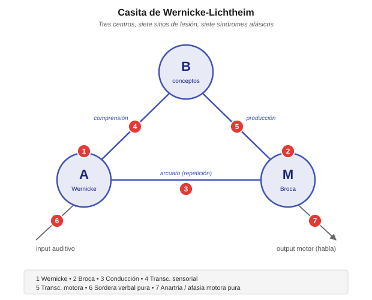

# Triángulo (casita) de Wernicke-Lichtheim

El diagrama de **Wernicke-Lichtheim** —también llamado *casita de Lichtheim*, *triángulo* o *house diagram*— es el **modelo fundacional de la aphasiology clásica**. Propuesto entre 1874 y 1885, es el primer intento serio de explicar sistemáticamente cómo distintos sitios de lesión producen distintos síndromes afásicos. Casi 150 años después, sigue siendo el esqueleto de la **clasificación clínica** de las afasias que se enseña en neurología, fonoaudiología y neuropsicología, aunque sus predicciones y su ontología teórica hayan sido fuertemente revisadas.

## Genealogía histórica

Tres papers seminales, todos alemanes, entre 1861 y 1885:

- **Paul Broca (1861)** describe el caso *"Tan"* (Leborgne). Identifica una lesión en la tercera circunvolución frontal izquierda asociada a la pérdida de producción del habla con comprensión relativamente preservada. Nace el concepto de **localización cerebral del lenguaje** y de "área de Broca".
- **Carl Wernicke (1874)** *Der aphasische Symptomencomplex*. Describe un segundo tipo de afasia: comprensión alterada, producción fluente pero llena de errores (parafasias), asociada a lesión temporal posterior izquierda (área de Wernicke). **Postula un tercer tipo predicho: afasia de conducción**, por lesión en el haz de fibras que conecta ambas áreas (arcuato). El paper es teórico + clínico: no solo describe, **predice**.
- **Ludwig Lichtheim (1885)** *On aphasia* (*Brain*, 7:433-484). Extiende el modelo de Wernicke agregando un **tercer centro (B) de "conceptos"** y sistematiza las conexiones. El diagrama resultante — la "casita" — predice **siete tipos distintos de afasia** a partir del sitio de lesión.

El modelo Wernicke-Lichtheim es el **primer modelo predictivo en neuropsicología**: partiendo de una arquitectura teórica, se derivan síndromes que después se van encontrando (o no) en la clínica.

## El diagrama

Tres centros y sus interconexiones:

- **A** — centro de las **imágenes auditivas de la palabra** (Wernicke, temporal posterior izquierdo).
- **M** — centro de las **imágenes motoras de la palabra** (Broca, frontal inferior izquierdo).
- **B** — centro de los **conceptos** (más difuso, no localizado en un solo punto — corteza asociativa).

Y tres tipos de vías:

- **A ↔ M** — el **haz arcuato** (fascículo arqueado). Permite la **repetición** directa (oír → repetir) sin pasar por el significado.
- **A ↔ B** — comprensión (oír → entender).
- **B ↔ M** — producción voluntaria (querer decir algo → producirlo).

Más las conexiones con periferia:

- **Input auditivo → A** (oído → representación acústica de palabra).
- **M → output motor** (representación motora → articulación).

**Casita de Wernicke-Lichtheim**. Tres centros (**A** auditivo, **M** motor, **B** conceptos) unidos por vías: A↔M es el haz arcuato (repetición), A↔B comprensión, B↔M producción voluntaria. Los siete puntos rojos numerados marcan los sitios de lesión que producen los siete síndromes afásicos clásicos. La lógica del modelo: **cada lesión desconecta funciones específicas**, produciendo un perfil predecible de qué habilidades se preservan y qué se pierden.

## Las siete afasias predichas por el modelo

Para cada síndrome: **qué está preservado** (columna verde) y **qué está alterado** (columna roja). El patrón sistemático es la firma de cada tipo.

### 1. Afasia de Wernicke (lesión en A)

- **Producción**: fluente pero llena de **parafasias** (fonémicas y semánticas), a veces jergafasia.
- **Comprensión**: severamente alterada — no puede acceder a las representaciones auditivas de las palabras.
- **Repetición**: alterada.
- **Explicación del modelo**: se destruyen las imágenes auditivas de las palabras, por lo que ni la comprensión (A→B) ni la repetición (A→M) funcionan.

### 2. Afasia de Broca (lesión en M)

- **Producción**: no fluente, esfuerzo articulatorio, agramática, **telegráfica**.
- **Comprensión**: relativamente preservada — al menos para material simple.
- **Repetición**: alterada.
- **Explicación del modelo**: se destruyen las imágenes motoras de las palabras. Como A y B están intactos, se puede entender pero no se puede producir. La comprensión "relativamente preservada" fue cuestionada después — hay déficits sintácticos también (ver [agrammatismo](#legado-y-lo-que-quedo-en-pie)).

### 3. Afasia de conducción (lesión en la vía A-M — arcuato)

- **Producción**: fluente, con parafasias fonémicas frecuentes especialmente al intentar repetir.
- **Comprensión**: preservada (A y B intactos, camino A→B funciona).
- **Repetición**: **severamente alterada** — no puede pasar directamente de oír a producir sin pasar por el concepto.
- **Explicación**: el paciente entiende y puede producir, pero la vía directa "input auditivo → output motor" está rota.

**Nota histórica**: este síndrome fue **predicho por Wernicke antes de haberse observado clínicamente**. Su descripción posterior en pacientes fue una validación fuerte del enfoque teórico.

### 4. Afasia transcortical sensorial (lesión en la vía A-B)

- **Producción**: fluente, con parafasias.
- **Comprensión**: **muy alterada** — las palabras entran a A pero no llegan al centro conceptual.
- **Repetición**: **preservada** — el camino A→M sigue funcionando.
- **Explicación**: puede oír y repetir palabras sin entenderlas. Fenómeno clínico llamativo: **ecolalia** (repite frases del examinador sin comprenderlas).

### 5. Afasia transcortical motora (lesión en la vía B-M)

- **Producción**: **muy reducida** — apatía verbal, iniciación difícil, respuestas muy breves.
- **Comprensión**: preservada.
- **Repetición**: **preservada**.
- **Explicación**: puede entender y repetir, pero no puede iniciar producción voluntaria desde el concepto. Ideas para decir + capacidad motora intactas, pero la vía que las conecta está rota.

### 6. Sordera verbal pura (lesión en el input auditivo → A)

- **Producción**: preservada.
- **Comprensión**: alterada solo para material verbal auditivo — puede leer, escribir, entender gestos.
- **Repetición**: alterada por vía auditiva; preservada por lectura.
- **Explicación**: la información acústica no llega al centro A, pero A mismo está intacto. Es una desconexión aferente.

### 7. Anartria / afasia motora pura (lesión en el output M → articulación)

- **Producción**: alterada — problemas puros de programación motora del habla.
- **Comprensión**: preservada.
- **Repetición**: alterada (por output).
- **Explicación**: M está intacto pero desconectado del sistema motor articulatorio. Es más un déficit **de salida** que del lenguaje propiamente dicho.

### Bonus: afasia mixta transcortical (lesión conjunta 4 + 5)

Si se destruyen las dos vías **B-A y B-M** (dejando A, M y su conexión intactos), el paciente **repite pero no comprende ni produce voluntariamente**. Es el llamado **síndrome de aislamiento del área del lenguaje** (Geschwind et al. 1968), descrito en pacientes con hipoxia severa que dañó los bordes de la zona perisilviana pero respetó el núcleo.

## Por qué el modelo fue revolucionario

Tres aportes teóricos que hacen a Wernicke-Lichtheim un modelo bisagra:

1. **Localización específica de funciones**: no todo el cerebro hace todo. Hay centros con roles funcionales distintos. Esto era controversial en 1874 (Flourens había defendido lo contrario).

2. **Desconexión como mecanismo de déficit**: no todos los síndromes vienen de destruir un centro; algunos vienen de **cortar la conexión entre centros preservados**. La afasia de conducción es el ejemplo canónico. Esto anticipa el enfoque de **"neurología conductual" de Geschwind (1965)** *"Disconnexion syndromes in animals and man"*.

3. **Poder predictivo**: el modelo no solo describe lo observado, **predice síndromes que después se buscan y encuentran**. Es el rasgo que distingue una teoría científica de una taxonomía descriptiva.

## Críticas y revisiones

### La crítica cognitiva (Marshall & Newcombe 1973; Caramazza 1984; Ellis & Young 1988)

El modelo Wernicke-Lichtheim opera en un **nivel demasiado grueso**. Habla de "imágenes auditivas de palabras" y "imágenes motoras de palabras" como si fueran unidades simples. La **neuropsicología cognitiva** de los 80s mostró que dentro de "A" y "M" hay múltiples módulos disociables:

- Léxico input auditivo vs. léxico input visual (leer vs. oír son distintos).
- Léxico output fonológico vs. léxico output ortográfico (hablar vs. escribir son distintos).
- Sistema semántico único vs. múltiples sistemas semánticos (¿una sola B, o varias según modalidad?).

Los **modelos cognitivos** posteriores (Ellis & Young 1988; Patterson & Shewell 1987) proponen arquitecturas con 15-20 módulos, no 3.

### La crítica localizacionista (Mesulam 1990; Hickok & Poeppel 2007)

La neuroimagen moderna mostró que **el "área de Wernicke" no es un solo lugar**, y que la comprensión y producción del lenguaje reclutan **redes distribuidas**, no puntos discretos. El modelo dual-stream de **Hickok & Poeppel (2007)** propone:

- **Vía ventral** (temporal): sonido → significado (comprensión).
- **Vía dorsal** (parieto-frontal): sonido → articulación (repetición, aprendizaje fonológico).

Es una **actualización estructural** del modelo Wernicke-Lichtheim con neuroanatomía contemporánea: dos vías en lugar de una sola conexión, redes distribuidas en lugar de puntos, pero mantiene la lógica de que hay especialización funcional y desconexiones.

### Los síndromes clásicos no son tan puros

Al aplicar test cognitivos finos, los pacientes reales rara vez encajan limpiamente en las 7 categorías. Los perfiles son mixtos, hay variabilidad individual grande, y la clasificación categorial ha sido reemplazada en investigación por **caracterización de déficits específicos** (por módulo, no por síndrome). Sin embargo, en la práctica clínica los rótulos clásicos siguen siendo útiles como primera aproximación.

## Legado y lo que quedó en pie

A pesar de las críticas, varios aportes del modelo persisten:

- **La clasificación clínica** (Wernicke, Broca, conducción, transcortical, global) sigue siendo el vocabulario estándar en neurología, fonoaudiología y neuropsicología clínica.
- **La lógica de "predecir síndromes a partir de arquitectura teórica"** es el método de la neuropsicología cognitiva contemporánea.
- **El énfasis en las desconexiones** anticipa la neurociencia de redes moderna.
- **La distinción entre repetición y comprensión** como funciones disociables sigue siendo diagnósticamente útil (una tarea de repetición sin comprensión es la firma clínica de afasia de conducción).
- El **agramatismo** — luego caracterizado con detalle por Grodzinsky, Friedmann, Bastiaanse, Druks — es la profundización del cuadro que Broca observó en producción y que la casita explica pobremente en comprensión.

## Conexiones en este sitio

- [Mecanismos de recuperación post-lesión](../neurobiologia/mecanismos-recuperacion-post-lesion.md) — cómo el cerebro se reorganiza después de las lesiones que la casita categoriza.
- [Modelos basados en memoria](../modelos-cognitivos/modelos-basados-memoria.md) — ACT-R / Lewis & Vasishth como marco moderno para entender déficits sintácticos en afasia agramática (Caplan, Friedmann & Gvion).
- [Modelos lexicalistas / conexionistas](../modelos-cognitivos/modelos-lexicalistas.md) — la alternativa distribuida a la localización estricta del modelo clásico.
- [Agreement attraction](../modelos-cognitivos/agreement-attraction-distributividad.md) — errores de concordancia en afasia agramática, un caso donde el modelo Wernicke-Lichtheim no tiene mecanismo pero los modelos cognitivos sí.

## Referencias clave

- **Broca, P. (1861)** "Remarques sur le siège de la faculté du langage articulé, suivies d'une observation d'aphémie" *Bulletin de la Société d'Anatomie de Paris* 6:330-357. **El caso Leborgne / Tan.**
- **Wernicke, C. (1874)** *Der aphasische Symptomencomplex: Eine psychologische Studie auf anatomischer Basis*. Breslau: Cohn & Weigert. **El modelo original con la predicción de la afasia de conducción.**
- **Lichtheim, L. (1885)** "On aphasia" *Brain* 7:433-484. **La casita** con los siete tipos de afasia sistematizados.
- **Geschwind, N. (1965)** "Disconnexion syndromes in animals and man" *Brain* 88:237-294, 585-644. **Actualización clásica** del enfoque de desconexión.
- **Geschwind, N., Quadfasel, F. A. & Segarra, J. M. (1968)** "Isolation of the speech area" *Neuropsychologia* 6:327-340. La afasia mixta transcortical.
- **Marshall, J. C. & Newcombe, F. (1973)** "Patterns of paralexia" *Journal of Psycholinguistic Research* 2:175-199. Inicio de la crítica cognitiva.
- **Caramazza, A. (1984)** "The logic of neuropsychological research and the problem of patient classification in aphasia" *Brain and Language* 21:9-20. La crítica cognitiva sistematizada.
- **Ellis, A. W. & Young, A. W. (1988)** *Human Cognitive Neuropsychology*. Hove: Lawrence Erlbaum. **Los modelos cognitivos** con 15-20 módulos.
- **Mesulam, M. M. (1990)** "Large-scale neurocognitive networks and distributed processing for attention, language, and memory" *Annals of Neurology* 28:597-613. La crítica de redes distribuidas.
- **Hickok, G. & Poeppel, D. (2007)** "The cortical organization of speech processing" *Nature Reviews Neuroscience* 8:393-402. **Modelo dual-stream** — actualización moderna del Wernicke-Lichtheim.
- **Cuetos, F. (2012)** *Neurociencia del Lenguaje. Bases neurológicas e implicancias clínicas*. Madrid: Panamericana. Manual de referencia en español.
- **González Lázaro, P. & González Ortuño, B. (2012)** *Afasia: De la teoría a la práctica*. México: Panamericana. Cubre casita + clasificación clínica.
- **Ardila, A. (2005)** *Las Afasias*. Universidad de Guadalajara. Libre en [aphasia.org/libroespanol.php](https://www.aphasia.org/libroespanol.php).
