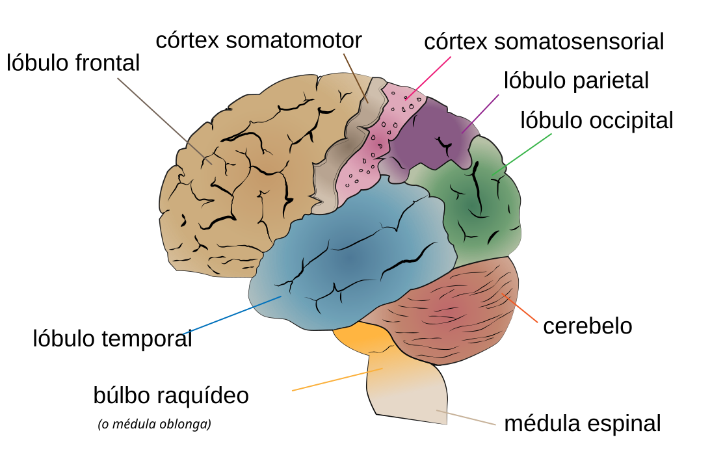

# Neurobiología

Conceptos básicos de neurobiología, fisiología y anatomía del sistema nervioso que aparecen en el seminario de **Neurofisiología y procesos cognitivos básicos**.

{ width="600" }
*Lóbulos del cerebro humano (vista lateral): frontal, parietal, temporal, occipital. Fuente: Jkwchui, [Wikimedia Commons](https://commons.wikimedia.org/wiki/File:Cerebrum_lobes-es.svg), CC BY-SA 3.0.*

## En esta sección

### Marcos generales

- **[Las 4 preguntas de Tinbergen y niveles de análisis](tinbergen-niveles-analisis.md)** — el marco que ordena cualquier pregunta de neurociencia (función, mecanismo, ontogenia, filogenia) y los niveles a los que se puede estudiar (comportamental, fisiológico, molecular).
- **[Bottom-up vs. top-down](bottom-up-top-down.md)** — los dos enfoques metodológicos que conviven en neurociencia. Distinción epistemológica útil para entender por qué la primera mitad del programa va de neurona a cognición y la segunda mitad al revés.
- **[Bases físico-químicas para entender la neurona](bases-fisicoquimicas.md)** — repaso mínimo de átomos, iones, cargas, voltaje y gradientes. Pre-requisito para todo lo que viene en U1 y U2.
- **[Marr — modelo computacional de la visión (y sus continuidades)](marr-vision-computacional.md)** — los tres niveles de análisis (computacional, algorítmico, implementacional), el pipeline esbozo primario → 2½D → 3D, y cómo el programa de Marr llega hasta las redes convolucionales actuales y el predictive coding.

### Conceptos del curso

- **[Sincitio y la doctrina de la neurona](sincitio.md)** — qué es un sincitio, por qué importa históricamente en neurociencia (Golgi vs. Cajal) y dónde sigue siendo útil hoy.
- **[Plasticidad cerebral adulta — experimentos fundacionales](plasticidad-experimentos-fundacionales.md)** — Merzenich, Kaas & Killackey, Wall & Egger: los tres trabajos que demolieron la idea de que el cerebro adulto era inmodificable.
- **[Ontogenia y filogenia](ontogenia-filogenia.md)** — desarrollo individual vs. evolución de la especie; dos planos que conviene no confundir cuando se habla del encéfalo humano.
- **[Mecanismos celulares de recuperación post-lesión](mecanismos-recuperacion-post-lesion.md)** — equilibrio iónico, reabsorción del edema, diasquisis reversa: cómo el cerebro recupera función a corto plazo después de una lesión.
- **[Mecanismos de plasticidad estructural y sináptica](plasticidad-estructural-mecanismos.md)** — factores neurotróficos, LTP/LTD, desenmascaramiento sináptico, brotes axonales, regeneración: la maquinaria celular de la recuperación a mediano-largo plazo.
- **[Neuronas tipo ensamble (cell assemblies)](neuronas-ensamble.md)** — la idea de Hebb (1949) sobre representaciones distribuidas y "neurons that fire together, wire together".
- **[FOXP2](foxp2.md)** — el supuesto "gen del lenguaje": qué es realmente, qué descubrió la familia KE, y por qué la etiqueta se quedó corta.
